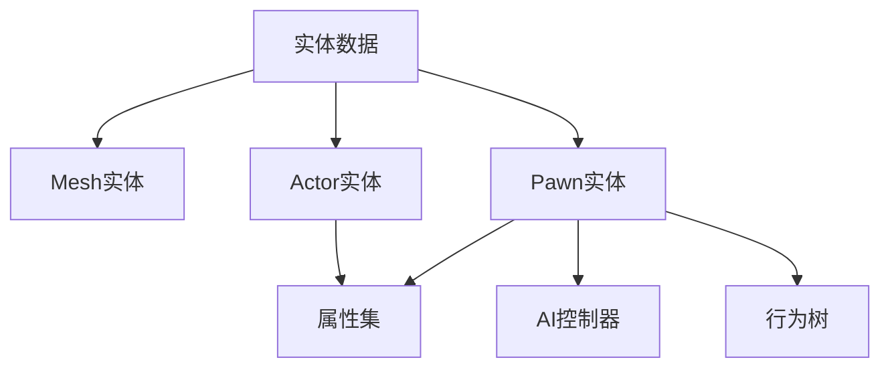

# 生成器系统

* **插件未开源**

## 作者信息
Copyright FirePlume, All Rights Reserved. Email: fireplume@126.com
 
作者网址：
[Bilibili](https://space.bilibili.com/395084718)、
[YouTube](https://www.youtube.com/@FirePlume126)、
[GitHub](https://www.github.com/FirePlume126)

**[返回目录](https://www.github.com/FirePlume126/FP_Readme#Directory)**

<a name="fpspawnersystem"></a>
## FPSpawnerSystem

生成器系统

---

**生成器目录**

- [使用指南](#fpspawnersystem_quickstart)：快速使用本插件
* [编辑器模块](#fpspawnersystem_fpspawnersystemeditor)：此插件的编辑器模块
	- [实体管理器](#fpspawnersystemeditor_entitymanager)：在指定区域计算并生成实体数据
		- [刷新散布数据](#fpspawnersystemeditor_refreshscatterdata)：移除旧散布数据并生成新散布数据
		- [清除散布数据](#fpspawnersystemeditor_clearscatterdata)：清除散布数据，强行停止散布
		- [应用调试数据](#fpspawnersystemeditor_applydebugdata)：自定义实体变换，应用自定义的数据
		- [应用散布数据](#fpspawnersystemeditor_applyscatterdata)：生成实体并清空散布数据，应用后实体将不受此插件的[运行时模块](#fpspawnersystem_fpspawnersystem)管理
		- [管理器设置](#fpspawnersystemeditor_managersettings)：针对运行时状态的设置，用来控制实体管理器激活
	- [散布策略](#fpspawnersystemeditor_scatterstrategy)：在派生类实现生成实体变换的逻辑
		- [网格散布](#fpspawnersystemeditor_gridscatter)：根据实体数量将散布区域等分为多个网格区域，并在每个网格区域内随机偏移生成实体数据
		- [随机散布](#fpspawnersystemeditor_randomscatter)：在场景随机生成实体数据

- [运行时模块](#fpspawnersystem_fpspawnersystem)：此插件的运行时模块
 	- [运行流程图](#fpspawnersystem_runtimeflowchart)：包含初始化流程和激活流程思维导图，以及加载范围示意图
	- [功能对比](#fpspawnersystem_functioncomparison)：生成器系统VS世界分区
	- [实体数据管理器](#fpspawnersystem_entitydatamanager)：管理编辑器状态下[实体管理器](#fpspawnersystemeditor_entitymanager)生成的实体数据
		- [生成器设置](#fpspawnersystem_spawnersettings)：定义此场景(关卡)中生成器系统的运行时参数
		- [实体数据调试](#fpspawnersystem_entitydatadebug)：提供统计数据查看、数据打印与数据清理/迁移操作，用于调试与资源优化。
	- [生成器管理子系统](#fpspawnersystem-managersubsystem)：管理实体数据并动态生成实体
		- [激活源](#fpspawnersystem_activationsource)：激活源会作为运行时动态激活实体的锚点
		- [分区网格管理器](#fpspawnersystem_partitiongridmanager)：管理[分区网格](#fpspawnersystem_runtimecell)，根据[激活源](#fpspawnersystem_activationsource)位置在异步线程计算需要加载/卸载的网格和实体
			- [分区网格计算](#fpspawnersystem_partitiongridcalculation)：在异步线程计算需要加载/卸载的网格单元
	- [实体数据](#fpspawnersystem_entitydata) 生成器实体数据是生成器系统的核心数据资产类
		- [实体属性集](#fpspawnersystem_entityattributeset)：自定义实体属性，支持配置随机属性范围，卸载后保留于内存并可持久化至硬盘
		- [实体接口](#fpspawnersystem_entityinterface)：通过此接口获取实体数据
		- [生成器保存数据](#fpspawnersystem_savedata) 将运行时实体状态、序列化属性集等数据进行保存
		- [实体LOD](#fpspawnersystem_entitylod)：客户端用于优化性能的机制
	- [运行时数据管理类](#fpspawnersystem-runtimeprojectsettings)：这些类主要用于在游戏运行时高效处理的数据。
		- [运行时实体](#fpspawnersystem_runtimeentity)：管理运行时的实体数据
		- [运行时实体管理器](#fpspawnersystem_runtimeentitymanager)：管理[实体管理器](#fpspawnersystemeditor_entitymanager)的[运行时实体](#fpspawnersystem_runtimeentity)
		- [运行时单元格](#fpspawnersystem_runtimecell)：管理单元格区域内可被激活的[运行时实体](#fpspawnersystem_runtimeentity)
* [项目设置](#fpspawnersystem-projectsettings)：此插件的项目设置
- [函数库](#fpspawnersystem-functionlibrary)：此插件的函数库
---

<a name="fpspawnersystem_quickstart"></a>
### 使用指南

**快速使用本插件。只需完成第1-3步骤即可实现插件的基本功能，其他功能可根据需求使用。**

1、继承`UFPSpawnerEntityData`创建自己的[实体数据](#fpspawnersystem_entitydata)，在该资产中添加所需的模型资源(`Actor`或网格体)。

2、在关卡指定区域放置[实体管理器](#fpspawnersystemeditor_entitymanager)，并设置散布区域的范围，
给[实体管理器](#fpspawnersystemeditor_entitymanager)指定使用的[实体数据](#fpspawnersystem_entitydata)和实体数量，
点击[刷新散布数据](#fpspawnersystemeditor_refreshscatterdata)生成实体散布数据。


3、运行时只会在[激活源](#fpspawnersystem_activationsource)返回的位置附近生成实体。
给`APlayerController`添加`FPSpawnerActivationSourceComponent`组件使玩家成为[激活源](#fpspawnersystem_activationsource)，当`bUseCameraLocation = true`时，返回当前摄像机位置，否则返回`Pawn`的位置。

4、根据[功能对比](#fpspawnersystem_functioncomparison)判断实体是用此插件管理还是用[世界分区](https://dev.epicgames.com/documentation/unreal-engine/world-partition-in-unreal-engine)管理。
对于静态实体建议通过[应用散布数据](#fpspawnersystemeditor_applyscatterdata)功能将实体提交给[世界分区](https://dev.epicgames.com/documentation/unreal-engine/world-partition-in-unreal-engine)进行统一管理。

5、[实体管理器](#fpspawnersystemeditor_entitymanager)的默认状态由细节面板中的[管理器设置](#fpspawnersystemeditor_managersettings)控制。
当`bAutoActivate = true`时会自动激活[实体管理器](#fpspawnersystemeditor_entitymanager)；
若`ManagerName`不为空时，可以通过[函数库](#fpspawnersystem-functionlibrary)的函数`TryModifyEntityManagerState()`修改实体管理器状态，同名管理器会被同时控制。
可以通过[函数库](#fpspawnersystem-functionlibrary)的函数ResetAllEntityManagers()重置所有实体管理器，也会重置所有实体并清除所有保存数据。


|请求类型|描述|
|:-:|:-:|
|None|停用实体管理器，管理的实体也会被停用|
|Activate|激活实体管理器，管理的实体会被注册到[分区网格管理器](#fpspawnersystem_partitiongridmanager)|
|Reset|重置实体管理器，管理器的状态会恢复到默认值(和`bAutoActivate`相同)，实体的状态也会被重置|
|Remove|移除实体管理器，实体数据和保存的序列化数据会被清空|

6、当管理实体的实体管理器被激活时，可以通过[函数库](#fpspawnersystem-functionlibrary)的函数`TryModifyEntityState()`修改实体状态。
实体句柄(EntityHandle)可以通过[函数库](#fpspawnersystem-functionlibrary)的函数`GetEntityHandle()`或[实体接口](#fpspawnersystem_entityinterface)获取。
如果调用`AActor::Destroy()`删除实体，会自动调用此函数，且请求类型为`Destroy`。


|请求类型|描述|
|:-:|:-:|
|None|把实体状态更改为停用，实体保存的序列化数据会被清空|
|Activate|把实体状态更改为闲置，实体会被注册到[分区网格管理器](#fpspawnersystem_partitiongridmanager)，只有注册的实体才会被[激活源](#fpspawnersystem_activationsource)激活|
|Destroy|销毁实体，若实体支持复活([实体数据](#fpspawnersystem_entitydata)中`RespawnTime > 0.0f`)，则实体状态将被设置为复活，<br>并在经过`RespawnTime`时间后可以被重新激活，否则实体状态将被设置为停用|
|Reset|把实体状态更改为闲置，并重置数据|

7、[生成器保存数据](#fpspawnersystem_savedata)：将运行时实体管理器状态、实体状态、序列化属性集等数据进行保存，并在下次启动游戏时重新加载这些数据，以恢复生成器系统的运行状态。

仅当实体的[实体数据](#fpspawnersystem_entitydata)中`bShouldSaveData = true`时，该实体的数据才会被序列化保存。


|[函数库](#fpspawnersystem-functionlibrary)的函数|调用时机|描述|
|:-:|:-:|:-:|
|`GetSpawnerSaveData()`|需要保存数据时调用|获取生成器保存数据，可以将数据保存在硬盘|
|`ApplySpawnerSaveData()`|游戏开始时调用一次，建议在`AGameModeBase::InitGame()`或`AGameModeBase::BeginPlay()`中执行|应用生成器保存数据|

8、为实体`Actor`实现[实体接口](#fpspawnersystem_entityinterface)`FPSpawnerEntityInterface`后，可通过该接口获取实体数据。若实体为`APawn`类型，还可将接口应用于其关联的`AAIController`。


9、继承[实体属性集](#fpspawnersystem_entityattributeset)(`UFPSpawnerEntityAttributeSet`)定义实体的自定义属性，支持为特定数据类型(`int32`、`int64`、`float`、`double`、`FString`、`FName`、`FText`)设置随机范围。
实体卸载后，属性集会序列化保留在内存中。在关联的[实体数据](#fpspawnersystem_entitydata)中设置`bShouldSaveData = true`，[生成器保存数据](#fpspawnersystem_savedata)时会将属性集写入硬盘。


10、通过[项目设置](#fpspawnersystem-projectsettings)对[实体LOD](#fpspawnersystem_entitylod)进行全局配置。
如果要对单个实体的LOD覆盖，可以在[实体数据](#fpspawnersystem_entitydata)中设置`bLODArrayOverrides = true`，为特定实体设置独立的LOD行为。<br>
[实体LOD](#fpspawnersystem_entitylod)仅影响本地客户端性能。如需提升整体游戏性能，建议在[实体数据管理器](#fpspawnersystem_entitydatamanager)的[生成器设置](#fpspawnersystem_spawnersettings)中合理配置参数。
适当调整可在保证视觉体验的同时显著优化性能，但可能会影响加载范围或响应速度。

<a name="fpspawnersystem_fpspawnersystemeditor"></a>
### FPSpawnerSystemEditor

生成器系统编辑器，在指定区域计算并生成实体数据

* **此模块的主要类**

|类名|描述|
|:-:|:-:|
|FPSpawnerEntityManagerEdActor|[实体管理器](#fpspawnersystemeditor_entitymanager)，在指定区域计算并生成实体数据，此Actor仅在编辑器有效，放在场景大纲中使用|
|FPSpawnerScatterBase|[散布策略](#fpspawnersystemeditor_scatterstrategy)基类，在派生类实现生成实体变换的逻辑|
|FPSpawnerScatter_Grid|[网格散布](#fpspawnersystemeditor_gridscatter)，根据实体数量将散布区域等分为多个网格区域，并在每个网格区域内随机偏移生成实体数据|
|FPSpawnerScatter_Random|[随机散布](#fpspawnersystemeditor_randomscatter)，在场景随机生成实体数据|
|FPSpawnerDebugComponent|生成器调试组件，管理调试网格，选中网格时临时生成目标实体，实现[应用调试数据](#fpspawnersystemeditor_applydebugdata)的逻辑|
|FPSpawnerBlockingVolume|生成器阻挡体，禁止在此区域生成实体，此Actor仅在编辑器有效，放在场景大纲中使用|	
|FPSpawnerActivationSourceEdActor|[激活源](#fpspawnersystem_activationsource)编辑器Actor，编辑器用来测试激活实体的锚点，此Actor仅在编辑器有效，放在场景大纲中使用|

<a name="fpspawnersystemeditor_entitymanager"></a>
#### 实体管理器

实体管理器，在指定区域计算并生成实体数据，生成的实体数据保存在[实体数据管理器](#fpspawnersystem_entitydatamanager)中。此Actor仅在编辑器有效，放在场景大纲中使用。


<a name="fpspawnersystemeditor_refreshscatterdata"></a>
* **刷新散布数据**

移除旧散布数据并生成新散布数据。在**刷新散布数据**前，需先添加[散布策略](#fpspawnersystemeditor_scatterstrategy)算法，设置[实体数据](#fpspawnersystem_entitydata)及生成数量，并调整盒体组件范围，确保在指定区域内生成新的实体数据。


<a name="fpspawnersystemeditor_clearscatterdata"></a>
* **清除散布数据**

清除散布数据，强行停止散布

<a name="fpspawnersystemeditor_applydebugdata"></a>
* **应用调试数据**

自定义实体变换，应用自定义的数据，[刷新散布数据](#fpspawnersystemeditor_refreshscatterdata)后，让`bDebugScatterData = true`且`bCustomScatterData = true`时，可以通过选中**调试网格**(图片中的箭头，双击鼠标左键选中时会变成目标实体)自定义实体的变换。


自定义实体的变换后，**应用调试数据**的按钮将变为可编辑状态，应用后就可以使用自定义实体的变换。


<a name="fpspawnersystemeditor_applyscatterdata"></a>
* **应用散布数据**

生成实体并清空散布数据，应用后实体将不受此插件的[运行时模块](#fpspawnersystem_fpspawnersystem)管理。<br>
静态或不常变化的实体，推荐使用[世界分区](https://dev.epicgames.com/documentation/unreal-engine/world-partition-in-unreal-engine)进行持久化管理；<br>
需要动态修改或控制的实体，推荐保留在[运行时模块](#fpspawnersystem_fpspawnersystem)进行管理。<br>

如果[实体数据](#fpspawnersystem_entitydata)是`Actor`，会直接生成Actor。<br>
如果[实体数据](#fpspawnersystem_entitydata)是`Mesh`，参考**世界分区**，在`Mesh`所在的网格单元中生成一个`FPSpawnerScatterMeshAttachActor`，用于统一管理该单元内由插件生成的所有网格实体，网格单元的大小可通过[项目设置](#fpspawnersystem-projectsettings)中的InstancedMeshGridSize设置。


<a name="fpspawnersystemeditor_managersettings"></a>
* **管理器设置**

针对运行时状态的设置，用来控制实体管理器激活

```c++
// 实体管理器设置
USTRUCT(BlueprintType)
struct FFPSpawnerEntityManagerSettings
{
	GENERATED_BODY()

public:

	// 启动游戏时自动激活，bAutoActivate为false且AreaName为空时，无法使用此散布区域实体数据，所以AreaName为空时，bAutoActivate只能为true
	UPROPERTY(EditAnywhere, BlueprintReadWrite)
	bool bAutoActivate = true;

	// 管理器名称，可以通过此名称手动控制管理器
	UPROPERTY(EditAnywhere, BlueprintReadWrite)
	FName ManagerName = NAME_None;
};
```

1、`bAutoActivate = true`时，启动游戏时自动激活此实体管理器管理的实体。当实体激活时，实体附近存在[激活源](#fpspawnersystem_activationsource)时生成实体

2、`ManagerName`不为空时，可以通过[函数库](#fpspawnersystem-functionlibrary)的函数`TryModifyEntityManagerState()`手动控制管理器

```c++
// 实体管理器请求类型
UENUM(BlueprintType)
enum class EFPSpawnerEntityManagerRequestType : uint8
{
	// 停用实体管理器
	None,

	// 激活实体管理器
	Activate,

	// 重置实体管理器，实体状态也会被重置
	Reset,

	// 移除实体管理器
	Remove,
};

// 尝试修改实体管理器状态
// @param InManagerName 实体管理器名称
// @param InRequestType 实体管理器请求类型
UFUNCTION(BlueprintCallable, BlueprintAuthorityOnly, meta = (WorldContext = "WorldContextObject"), Category = "FPSpawner")
static bool TryModifyEntityManagerState(const UObject* WorldContextObject, const FName& InManagerName, const EFPSpawnerEntityManagerRequestType InRequestType);
```

<a name="fpspawnersystemeditor_scatterstrategy"></a>
#### 散布策略

散布策略是生成器系统编辑器模块的核心逻辑部分，用于定义实体在场景中如何分布。
开发者通过继承该基类并在派生类中实现具体的散布行为，可以灵活地扩展不同类型的散布策略。<br>
每帧最大散布对象数可以通过[项目设置](#fpspawnersystem-projectsettings)中的MaxScatterObjectsPerTick设置，用于控制性能消耗，防止一次性生成大量对象导致卡顿或掉帧。

以下为派生类需要使用的成员变量和方法：
```c++
// 散布模式
UPROPERTY(EditAnywhere)
FFPSpawnerScatterMode ScatterMode = FFPSpawnerScatterMode::Ground;

// 跟踪参数，在地面生成时检测有效表面；在空中生成时检测无效表面
UPROPERTY(EditAnywhere)
FFPSpawnerTraceParams TraceParams;

// 区域数据
FFPSpawnerAreaData AreaData;

// 实体数据列表
TArray<FFPSpawnerScatterEntityData> EntityDataList;

// 计算散布数据，派生类需重写此方法以实现具体散布逻辑
virtual void ComputeScatterData() {};

// 完成散布策略，计算完成后调用。派生类可选择性重写以清理资源
virtual void CompleteScatterStrategy();

// 更新散布实体数据，将计算结果提交到实体数据管理器
void UpdateScatterEntityData(const FFPSpawnerScatterData& NewScatterData);
```

<a name="fpspawnersystemeditor_traceparameters"></a>
跟踪参数(TraceParameters)

用于判断是否可以生成实体。在地面生成时检测有效表面；在空中生成时检测无效表面


|属性名称|类型|描述|
|:-:|:-:|:-:|
|CollisionChannels|`TArray<TEnumAsByte<ECollisionChannel>>`|碰撞检测通道列表，用于判断地面或障碍物|
|bTraceComplex|`bool`|是否使用复杂碰撞进行检测|
|IgnoredActors|`TArray<TObjectPtr<AActor>>`|在追踪时忽略的Actor列表|
|PhysMaterials|`TArray<TObjectPtr<UPhysicalMaterial>>`|允许生成的物理材质类型|
|MaxSlopeAngle|`float`|最大允许斜坡角度，超过该角度的表面将被视为无效|
|NavFilterClass|`TSubclassOf<UNavigationQueryFilter>`|导航查询过滤器类，可以仅在导航区域生成|

以下为相关枚举结构体定义：
```c++
// 散布模式
UENUM(BlueprintType)
enum class FFPSpawnerScatterMode : uint8
{
	// 在地面生成实体
	Ground,

	// 在地面生成实体，旋转对齐法线方向
	GroundAligned,

	// 在空中生成实体
	Air,
};

// 生成区域数据
USTRUCT(BlueprintType)
struct FFPSpawnerAreaData
{
	GENERATED_BODY()

public:

	// 区域中心
	UPROPERTY(EditAnywhere, BlueprintReadWrite)
	FVector Origin = FVector::ZeroVector;

	// 盒子的范围(半尺寸)
	UPROPERTY(EditAnywhere, BlueprintReadWrite)
	FVector Extent = FVector::ZeroVector;

	// 区域旋转
	UPROPERTY(EditAnywhere, BlueprintReadWrite)
	FRotator Rotation = FRotator::ZeroRotator;
};

// 散布实体数据
USTRUCT(BlueprintType)
struct FFPSpawnerScatterEntityData
{
	GENERATED_BODY()

public:

	// 实体数量
	UPROPERTY(EditAnywhere, BlueprintReadWrite, meta = (ClampMin = 1))
	int32 EntityNumber = 10;

	// 实体数据
	UPROPERTY(EditAnywhere, BlueprintReadWrite)
	TSoftObjectPtr<UFPSpawnerEntityData> EntityData = nullptr;
};

// 生成器散布数据
USTRUCT()
struct FFPSpawnerScatterData
{
	GENERATED_BODY()

public:

	// 变换
	UPROPERTY()
	FTransform Transform = FTransform::Identity;

	// 实体数据
	UPROPERTY()
	TSoftObjectPtr<UFPSpawnerEntityData> EntityData = nullptr;
};
```

<a name="fpspawnersystemeditor_gridscatter"></a>
* **网格散布**

根据实体数量将散布区域等分为多个网格区域，并在每个网格区域内随机偏移生成实体数据。


|属性名称|类型|描述|
|:-:|:-:|:-:|
|RandomSeed|`int32`|随机种子，用于控制偏移的随机性。相同种子可复现相同的分布结果|
|MaxGridOffsetRatio|`float`|实体在网格区域内最大偏移比例，值越小实体分布越整齐|
|ScatterMode|`FFPSpawnerScatterMode`|散布模式，控制实体生成时的空间定位策略|
|HeightOffsetRange|`FVector2D`|对高度(Z轴)偏移范围，会受到缩放影响。ScatterMode为GroundAligned时，相对地面法线方向偏移范围|
|RotationYawRange|`FVector2D`|实体绕Yaw(Z轴)的随机旋转角度范围|
|RotationPitchRange|`FVector2D`|实体绕Pitch(Y轴)的随机旋转角度范围|
|RotationRollRange|`FVector2D`|实体绕Roll(X轴)的随机旋转角度范围|
|ScaleRange|`FVector2D`|实体缩放范围|
|TraceParams|[跟踪参数](#fpspawnersystemeditor_traceparameters)|用于判断是否可以生成实体。在地面生成时检测有效表面；在空中生成时检测无效表面|

<a name="fpspawnersystemeditor_randomscatter"></a>
* **随机散布**

在场景随机生成实体数据。


|属性名称|类型|描述|
|:-:|:-:|:-:|
|RandomSeed|`int32`|随机种子，用于控制偏移的随机性。相同种子可复现相同的分布结果|
|ScatterMode|`FFPSpawnerScatterMode`|散布模式，控制实体生成时的空间定位策略|
|BoxExtent|`FVector`|每个实体的盒体范围(半尺寸)，会受到缩放影响|
|RotationYawRange|`FVector2D`|实体绕Yaw(Z轴)的随机旋转角度范围|
|RotationPitchRange|`FVector2D`|实体绕Pitch(Y轴)的随机旋转角度范围|
|RotationRollRange|`FVector2D`|实体绕Roll(X轴)的随机旋转角度范围|
|ScaleRange|`FVector2D`|实体缩放范围|
|TraceParams|[跟踪参数](#fpspawnersystemeditor_traceparameters)|用于判断是否可以生成实体。在地面生成时检测有效表面；在空中生成时检测无效表面|

<a name="fpspawnersystem_fpspawnersystem"></a>
### FPSpawnerSystem

生成器系统，生成实体并对其进行管理。加载逻辑参考了[世界分区](https://dev.epicgames.com/documentation/unreal-engine/world-partition-in-unreal-engine)的逻辑，并在灵活性和可扩展性方面进行了增强。

* **此模块的主要类**

|类名|描述|
|:-:|:-:|
|FPSpawnerEntityDataManager|[实体数据管理器](#fpspawnersystem_entitydatamanager)，管理编辑器状态下[实体管理器](#fpspawnersystemeditor_entitymanager)生成的实体数据|
|FPSpawnerManagerSubsystem|[生成器管理子系统](#fpspawnersystem-managersubsystem)，管理实体数据并动态生成实体|
|FPSpawnerPartitionGridManager|[分区网格管理器](#fpspawnersystem_partitiongridmanager)，管理[分区网格](#fpspawnersystem_runtimecell)，根据[激活源](#fpspawnersystem_activationsource)位置在异步线程计算需要加载/卸载的网格和实体|
|FPSpawnerPartitionGridCalculation|[分区网格计算](#fpspawnersystem_partitiongridcalculation)，在异步线程计算需要加载/卸载的网格单元|
|FPSpawnerRuntimeEntity|[运行时实体](#fpspawnersystem_runtimeentity)，管理运行时的实体数据|
|FPSpawnerRuntimeEntityManager|[运行时实体管理器](#fpspawnersystem_runtimeentitymanager)，管理自己区域内的运行时实体|
|FPSpawnerRuntimeCell|[运行时单元格](#fpspawnersystem_runtimecell)，管理单元格区域内可被激活的实体|
|FPSpawnerActivationSourceInterface|[激活源](#fpspawnersystem_activationsource)，实现此接口的对象会作为运行时动态激活实体的锚点，支持添加给AActor或UActorComponent|
|FPSpawnerActivationSourceComponent|[激活源](#fpspawnersystem_activationsource)组件，添加此组件的Actor会作为动态激活实体的锚点；添加给APlayerController时，使用Pawn或摄像机的位置|
|FPSpawnerEntityData|[实体数据](#fpspawnersystem_entitydata)|
|FPSpawnerEntityAttributeSet|[实体属性集](#fpspawnersystem_entityattributeset)|
|FPSpawnerMeshEntityManager|生成器网格体实体管理器，管理生成器的所有[Mesh实体数据](#fpspawnersystem_entitydata_Mesh)|
|FPSpawnerStaticMeshComponent|生成器静态网格体组件|
|FPSpawnerScatterMeshAttachActor|[应用散布数据](#fpspawnersystemeditor_applyscatterdata)时，散布网格实体附着的Actor|
|FPSpawnerEntityComponent|生成器生成的实体自动添加此组件(不可手动添加)，服务器监听卸载、管理[实体属性集](#fpspawnersystem_entityattributeset)，客户端处理LOD|
|FPSpawnerEntityInterface|[实体接口](#fpspawnersystem_entityinterface)，通过此接口获取实体数据|

<a name="fpspawnersystem_runtimeflowchart"></a>
#### 运行流程图


1、绿色圆圈是加载范围；红色圆圈是卸载范围。<br>
2、绿色分区网格是加载网络；红色分区网格是未加载的范围。<br>
3、浅绿色区域加载实体；浅蓝色区域不再加载实体，已加载的实体不卸载；浅红色卸载实体。

<a name="fpspawnersystem_functioncomparison"></a>
#### 功能对比

此系统与[世界分区](https://dev.epicgames.com/documentation/unreal-engine/world-partition-in-unreal-engine)一样，采用基于[激活源](#fpspawnersystem_activationsource)位置的空间分区网格加载机制，并支持异步线程计算以提升性能。
但该系统并非对[世界分区](https://dev.epicgames.com/documentation/unreal-engine/world-partition-in-unreal-engine)系统的替代，而是对其静态实体管理能力的有效补充。对于地形装饰物、固定建筑等静态实体，仍推荐使用世界分区进行统一管理；
而对于可交互对象、NPC 等需要频繁修改或状态保存的动态实体，本系统展现出更高的灵活性与可控性。

对于静态实体建议通过[应用散布数据](#fpspawnersystemeditor_applyscatterdata)功能将实体提交给[世界分区](https://dev.epicgames.com/documentation/unreal-engine/world-partition-in-unreal-engine)进行统一管理。
然而，一旦实体数据被移交至[世界分区](https://dev.epicgames.com/documentation/unreal-engine/world-partition-in-unreal-engine)，这些实体将不再受此插件时功能控制。你可以根据实体需求在以下两种模式中进行选择：

|实体类型|推荐方案|说明|
|:-:|:-:|:-:|
|静态实体(如地形装饰物、固定建筑等)|世界分区|利用UE原生机制进行高效管理，内存占用低|
|动态实体(如可交互对象、NPC等)|生成器系统|支持运行时动态生成、修改和删除实体，提供自定义属性集、数据序列化保存与恢复功能，适合需要灵活控制与状态保存的实体|

|功能项|生成器系统|世界分区|
|:-:|:-:|:-:|
|数据存储方式|实体数据保存在内存<br>(可以通过[生成器保存数据](#fpspawnersystem_savedata)保存在硬盘)|未激活实体保存在硬盘<br>(运行时更节约内存)|
|加载机制|空间分区网格加载机制，并支持异步线程计算以提升性能|基于`World Partition`系统自动管理加载|
|激活逻辑|通过[激活源](#fpspawnersystem_activationsource)控制实体激活，同时支持手动控制是否允许被[激活源](#fpspawnersystem_activationsource)激活|依赖`IWorldPartitionStreamingSourceProvider`接口控制激活|
|动态编辑能力|支持运行时动态生成、修改、保存实体数据|不支持动态编辑|
|持久化能力|实体状态、属性集均可序列化保存<br>支持关卡切换后恢复运行时状态|不支持运行时状态的持久化|
|网络同步|支持网络同步，但尽量避免管理大量[Mesh实体数据](#fpspawnersystem_entitydata_Mesh)，以防止因频繁同步导致网络流量过大|同步机制成熟，适用于多人游戏场景|
|LOD 控制|支持自定义LOD行为<br>(隐藏实体、调整Tick频率、接口反馈)|不支持LOD控制|
|性能控制|多参数控制每帧最大加载/生成数量|加载由引擎统一调度|
|调试与开发体验|提供统计数据查看、数据打印与数据清理/迁移操作|调试工具完善|

<a name="fpspawnersystem_entitydatamanager"></a>
#### 实体数据管理器

实体数据管理器，用于管理由[实体管理器](#fpspawnersystemeditor_entitymanager)生成的**实体数据** 。仅存在于服务器端 ，且每个场景中只能存在一个实例，由程序强制控制以确保唯一性。
如果当前场景中没有**实体数据管理器**，开发者添加[实体管理器](#fpspawnersystemeditor_entitymanager)时，系统会自动创建一个**实体数据管理器**。

<a name="fpspawnersystem_spawnersettings"></a>
* **生成器设置**

定义此场景(关卡)中生成器系统的运行时参数


|属性名称|类型|描述|
|:-:|:-:|:-:|
|bAutoInitSpawner|`bool`|自动初始化[生成器管理子系统](#fpspawnersystem-managersubsystem)，为false时需要调用[函数库](#fpspawnersystem-functionlibrary)的函数`InitSpawnerSubsystem()`初始化[生成器管理子系统](#fpspawnersystem-managersubsystem)|
|bSyncEntityWithGrid |`bool`|实体的加载/卸载完全跟随实体所属的网格单元|
|bLoadGridsInDistanceOrder |`bool`|按距离顺序加载网格，优先加载与激活源处于相同高度层级的网格，再按水平距离由近到远排序加载|
|CellSize|`float`|分区网格的单元格大小|
|LoadingRange|`float`|加载范围，[激活源](#fpspawnersystem_activationsource)球形范围接触到网格单元时激活它，加载此范围内的实体|
|UnloadingRange|`float`|卸载范围，[激活源](#fpspawnersystem_activationsource)球形范围远离网格单元时卸载它，卸载此范围外卸载实体|
|ExclusionRange|`float`|排除范围，仅排除初次生成的实体，防止在[激活源](#fpspawnersystem_activationsource)太近的位置刷新实体|
|bEnableHeightLimit|`bool`|启用高度限制|
|CellHeight|`float`|单元格高度，限制单元格的高度|
|LoadingHeight|`float`|加载高度，限制加载的高度|
|MaxCalcTimePerFrame|`float`|[分区网格计算](#fpspawnersystem_partitiongridcalculation)时，每帧最大计算时间(毫秒)|
|MaxFrameTime|`float`|[分区网格计算](#fpspawnersystem_partitiongridcalculation)时，每帧最大时间(毫秒)|
|MaxActivateNumberPerTick|`int32`|每帧最大处理实体数据的数量|
|MaxSpawnNumberPerTick|`int32`|每帧最大生成实体的数量|
|MaxActorNumber|`int32`|最大生成Actor的数量|
|MaxMeshNumber|`int32`|最大生成网格体的数量|

<a name="fpspawnersystem_entitydatadebug"></a>
* **实体数据调试**

提供了用于调试和维护的功能，主要包括数据打印与数据清理/迁移操作，便于开发者进行资源统计、性能分析及数据维护。

1、打印散布数据(Print Scatter Data)，将当前的所有实体数据以表格形式输出到日志窗口，便于查看实体分布与内存占用情况。


2、操作散布数据(Operate Scatter Data)，`Remove Manager Id`输入All(不区分大小写)，移除所有数据；`Remove Manager Id`输入实体管理器ID，移除对应的实体数据。
`MoveTo Manager Id`输入实体管理器ID，将`Remove Manager Id`的实体数据移动到此ID的实体管理器。


3、在控制台输入指令`FP.Spawner.Debug.EntityCounts`可以查看实体总数、活动Actor计数和活动网格体计数。

<a name="fpspawnersystem-managersubsystem"></a>
#### 生成器管理子系统

生成器管理子系统是此模块的核心，仅在存在于服务器，管理实体数据并动态生成实体。

1、初始化条件

场景中必须存在一个有效的[实体数据管理器](#fpspawnersystem_entitydatamanager)，**生成器管理子系统**才可以被初始化。

|初始化方式|方法|描述|
|:-:|:-:|:-:|
|自动初始化|[生成器设置](#fpspawnersystem_spawnersettings)中设置`bAutoInitSpawner=true`|系统会在关卡加载完成后自动初始化，<br>适用于大多数运行时场景|
|手动初始化|调用[函数库](#fpspawnersystem-functionlibrary)的函数`InitSpawnerSubsystem()`|开发者可控制子系统的初始化时机，<br>适用于需要延迟加载或按需启动的场景|

2、子系统管理的数据

通过管理[运行时实体管理器](#fpspawnersystem_runtimeentitymanager)，管理所有[运行时实体](#fpspawnersystem_runtimeentity)数据。

```c++
// 实体管理器数据映射
TMap<FGuid, TSharedRef<FFPSpawnerRuntimeEntityManager>> EntityManagerDataMap;
```

3、通过[函数库](#fpspawnersystem-functionlibrary)的函数`TryModifyEntityManagerState()`和`TryModifyEntityState()`分别动态控制**实体管理器**和**实体**的状态，
实体销毁或停用时会重置实体的所以属性。

以下为相关枚举结构体定义：
```c++
// 实体管理器请求类型
UENUM(BlueprintType)
enum class EFPSpawnerEntityManagerRequestType : uint8
{
	// 停用实体管理器
	None,

	// 激活实体管理器
	Activate,

	// 重置实体管理器，实体状态也会被重置
	Reset,

	// 移除实体管理器
	Remove,
};

// 生成实体请求类型
UENUM(BlueprintType)
enum class EFPSpawnerEntityRequestType : uint8
{
	// 停用，把实体状态更改为停用
	None,

	// 激活，把实体状态更改为闲置
	Activate,

	// 销毁，如果实体可以复活，把实体状态改为复活，否则改为停用
	Destroy,

	// 重置，把实体状态更改为闲置，并重置数据
	Reset,
};
```

<a name="fpspawnersystem_activationsource"></a>
* **激活源**

激活源会作为运行时动态激活实体的锚点，激活源会激活其周围的分区网格，然后由系统根据距离进一步决定是否激活该网格中的实体。


1、绿色圆圈是加载范围；红色圆圈是卸载范围。<br>
2、绿色分区网格是加载网络；红色分区网格是未加载的范围。<br>
3、浅绿色区域加载实体；浅蓝色区域不再加载实体，已加载的实体不卸载；浅红色卸载实体。

在`AActor`或`UActorComponent`中实现`FPSpawnerActivationSourceInterface`接口，重写`GetActivationSourceLocation()`返回激活源位置，
并在适当时机调用`RegisterActivationSource()`注册激活源，不再需要时调用`UnregisterActivationSource()`注销激活源。

```c++
// 激活源，实现此接口的对象会作为运行时动态激活实体的锚点，支持添加给AActor或UActorComponent
class FPSPAWNERSYSTEM_API IFPSpawnerActivationSourceInterface
{
	GENERATED_BODY()

public:

	// 获取激活源位置，激活此位置附近的实体
	virtual FVector GetActivationSourceLocation() const = 0;

	// 注册激活源
	void RegisterActivationSource(const UObject* WorldContextObject);

	// 注销激活源
	void UnregisterActivationSource(const UObject* WorldContextObject);
};
```

直接为`Actor`添加`FPSpawnerActivationSourceComponent`组件即可自动成为激活源。若组件附加到普通`AActor`，则默认返回该`Actor`的位置；
若组件附加到`APlayerController`，当`bUseCameraLocation=true`时，返回当前摄像机位置，否则返回`Pawn`的位置。

<a name="fpspawnersystem_partitiongridmanager"></a>
* **分区网格管理器**

管理[分区网格](#fpspawnersystem_runtimecell)，根据[激活源](#fpspawnersystem_activationsource)位置通过[分区网格计算](#fpspawnersystem_partitiongridcalculation)异步线程计算出需要加载/卸载的网格，
然后基于[激活源](#fpspawnersystem_activationsource)位置进一步计算实体的新状态，可以通过[生成器设置](#fpspawnersystem_spawnersettings)的`bSyncEntityWithGrid`让实体的加载/卸载完全跟随实体所属的网格单元。

* 使用指南

1、初始化[生成器管理子系统](#fpspawnersystem-managersubsystem)后，该子系统会创建**分区网格管理器**并绑定函数接收实体状态。
```c++
// 创建分区网格管理器
template<class UserClass, typename FuncType>
static UFPSpawnerPartitionGridManager* CreatePartitionGridManager(const FFPSpawnerPartitionGridSettings& NewSettings, UserClass* InObject, FuncType InFunc);

// 绑定生成器管理子系统的函数↓↓↓

// 接收实体状态
void OnReceiveEntityState(const TWeakPtr<FFPSpawnerRuntimeEntity>& InRuntimeEntity, const EFPSpawnerEntityStateType NewEntityState);
```

2、注册实体或实体移动时调用`RegisterEntity()`，注销实体时调用`UnregisterEntity()`。
```c++
// 注册实体或实体移动时调用
void RegisterEntity(const TWeakPtr<FFPSpawnerRuntimeEntity>& InRuntimeEntity);

// 注销实体
void UnregisterEntity(const TWeakPtr<FFPSpawnerRuntimeEntity>& InRuntimeEntity);
```

3、更新分区网格时，传入[激活源](#fpspawnersystem_activationsource)位置数据，异步计算完成后，会通过绑定的函数返回实体新状态
```c++
// 更新分区网格
void UpdatePartitionGrid(const TArray<FVector>& NewSourceLocations);
```

<a name="fpspawnersystem_partitiongridcalculation"></a>
* **分区网格计算**

在异步线程计算需要加载/卸载的网格单元，此类继承`FRunnable`创建一个名为`PartitionGridThread`的后台线程，专门用于计算分区网格的加载/卸载逻辑。
可以通过[生成器设置](#fpspawnersystem_spawnersettings)的`bLoadGridsInDistanceOrder`让单元网络按距离顺序加载，优先加载与激活源处于相同高度层级的网格，再按水平距离由近到远排序加载。

* 使用指南

1、由[分区网格管理器](#fpspawnersystem_partitiongridmanager)创建并绑定函数接收`加载网格坐标`和`卸载网格坐标`

```c++
// 创建分区网格线程
// @param NewActivePartitionGrid 有实体的网格坐标
template<class UserClass, typename FuncType>
static FFPSpawnerPartitionGridCalculation* CreatePartitionGridThread(const FFPSpawnerPartitionGridCalculationSettings& NewCalculationSettings, TWeakPtr<TSet<FIntVector>> NewActivePartitionGrid, UserClass* InObject, FuncType InFunc);

// 绑定分区网格管理器的函数↓↓↓

// 接收分区网格
void OnReceivePartitionGrid_AnyThread(const TArray<FIntVector>& InLoadPartitionGridArray, const TSet<FIntVector>& InUnloadPartitionGridSet);
```

2、更新分区网格时，传入[激活源](#fpspawnersystem_activationsource)位置数据，计算完成后返回加载与卸载的网格列表。
其中`加载网格坐标`包含顺序信息，索引越小表示离[激活源](#fpspawnersystem_activationsource)越近。

```c++
// 更新分区网格
// @param NewSourceLocations 生成器保存的数据
// @param NewMovePartitionGrid 因实体移动而激活的网格坐标
void UpdatePartitionGrid(const TArray<FVector>& NewSourceLocations, const TSet<FIntVector>& NewMovePartitionGrid);
```

<a name="fpspawnersystem_entitydata"></a>
#### 实体数据

生成器实体数据是生成器系统的核心数据资产类，用于配置不同实体`Mesh`/`Actor`/`Pawn`)的生成规则与自定义参数。




|属性名称|类型|描述|
|:-:|:-:|:-:|
|EntityClass|`TSoftClassPtr<AActor>`|实体类，添加`Actor`时切换成`Actor`实体数据，添加`Pawn`时切换成`Pawn`实体数据|
|MeshDatas|`TArray<FFPSpawnerMeshData>`|网格数据，不为空时切换成`Mesh`实体数据|
|RespawnTime|`float`|重生时间，等于0时不重生，外部调用AActor::Destroy()或通过[函数库](#fpspawnersystem-functionlibrary)的函数`TryModifyEntityManagerState()`销毁`Actor`时，重新生成实体的时间间隔|
|LifeTime|`float`|生存时间，等于0时不死亡，当激活源加载实体时，实体从生成到当前的时间间隔如果超过该值，则销毁实体。在激活源附近的实体不会因生存时间过长而被销毁|

<a name="fpspawnersystem_entitydata_Mesh"></a>
`Mesh`实体数据


|属性名称|类型|描述|
|:-:|:-:|:-:|
|StaticMesh|`TSoftObjectPtr<UStaticMesh>`|静态网格资产|
|RelativeTransform|`FTransform`|相对变换|
|CollisionProfile|`FCollisionProfileName`|碰撞预设|
|Materials|`TArray<TSoftObjectPtr<UMaterialInstance>>`|替换网格的材质|

<a name="fpspawnersystem_entitydata_Actor"></a>
`Actor`实体数据


|属性名称|类型|描述|
|:-:|:-:|:-:|
|SpawnCollisionHandling |`ESpawnActorCollisionHandlingMethod`|生成Actor的碰撞处理方法|
|bDestroyAttachedActors|`boo`|是否销毁附加的`Actor`|
|bResetAttributesOnRespawn|`boo`|重生时是否重置属性|
|bShouldSaveData|`boo`|是否应该保存数据，为`true`时调用[函数库](#fpspawnersystem-functionlibrary)的函数`GetSpawnerSaveData()`保存此实体的数据，下此启动游戏时调用[函数库](#fpspawnersystem-functionlibrary)的函数`ApplySpawnerSaveData()`初始化属性|
|AttributeSet|`TObjectPtr<UFPSpawnerEntityAttributeSet>`|[实体属性集](#fpspawnersystem_entityattributeset)|
|bLODArrayOverrides|`boo`|LOD数组覆盖，为true时覆盖[项目设置](#fpspawnersystem-projectsettings)中的LODArray，使用仅属于此实体的LOD|
|LODArray|`FFPSpawnerLODArray`|LOD数组，定义多个LOD级别，按距离控制实体行为|

<a name="fpspawnersystem_entitydata_Pawn"></a>
`Pawn`实体数据


|属性名称|类型|描述|
|:-:|:-:|:-:|
|AIControllerClass|`TSoftClassPtr<AAIController>`|AI控制器类，当`Pawn`没有AI控制器时，使用此类创建控制器|
|BehaviorTree|`TSoftObjectPtr<UBehaviorTree>`|AI行为树|
|bDestroyController|`bool`|AI角色是否删除AI控制器，如果不删除，下次复活或激活将继续使用此控制器；实体被停用或重置时会强制销毁|

<a name="fpspawnersystem_entityattributeset"></a>
* **实体属性集**

自定义实体属性，支持配置随机属性范围。实体卸载后属性集会被序列化保留于内存，也可以写入硬盘实现数据持久化。

1、继承`UFPSpawnerEntityAttributeSet`创建自己的属性集类，并在其中定义任意数量的自定义属性。


2、添加给[实体数据](#fpspawnersystem_entitydata)可以设置属性默认值，数据类型`int32`、`int64`、`float`、`double`、`FString`、`FName`、`FText`支持设置随机范围。


3、如果实体实现了[实体接口](#fpspawnersystem_entityinterface)，可以通过接口的通过的`InitEntity()`和`RecycleAttributeSet()`函数分别获取和保存属性集。
实体拥有属性集是由[实体数据](#fpspawnersystem_entitydata)中指定的`AttributeSet`类为模板创建，随机生成专属自己的随机属性，并通过属性字符串映射进行反序列化与初始化。

4、当[实体数据](#fpspawnersystem_entitydata)的`bShouldSaveData=true`时，通过[生成器保存数据](#fpspawnersystem_savedata)可以把属性集保存在硬盘。
```c++
// 属性字符串映射，序列化的自定义属性集
UPROPERTY()
TMap<FString, FString> PropertyStringMap;
```

5、除了在编辑器中预设的属性，实体属性集还支持在运行时动态获取和更新新的属性字段，实现更灵活的数据管理与扩展性。
```c++
// 获取属性
// @param bIgnoreRandom 属性名称
// @param OutValue 属性名称对应的值
UFUNCTION(BlueprintCallable, BlueprintAuthorityOnly, CustomThunk, meta = (CustomStructureParam = "OutValue"), DisplayName = "GetAttribute", Category = "FPSpawner")
bool K2_GetAttribute(FString InPropertyName, int32& OutValue) const;
DECLARE_FUNCTION(execK2_GetAttribute);

// 更新属性
// @param bIgnoreRandom 属性名称
// @param OutValue 属性名称对应的值
UFUNCTION(BlueprintCallable, BlueprintAuthorityOnly, CustomThunk, meta = (CustomStructureParam = "InValue"), DisplayName = "UpdateAttribute", Category = "FPSpawner")
bool K2_UpdateAttribute(FString InPropertyName, const int32& InValue);
DECLARE_FUNCTION(execK2_UpdateAttribute);
```

<a name="fpspawnersystem_entityinterface"></a>
* **实体接口**

为实体Actor实现此接口后，可通过该接口获取实体数据。若实体为APawn类型，还可将接口应用于其关联的AAIController。如果APawn和AAIController都实现了此接口，服务器函数在AAIController执行，客户端函数在APawn执行。

```c++
class FPSPAWNERSYSTEM_API IFPSpawnerEntityInterface
{
	GENERATED_BODY()

public:

	// 初始化实体，激活生成实体时执行
	// @param EntityHandle 实体句柄，生成器系统的实体唯一标识
	// @param AttributeSet 属性集，获取初始化实体需要的属性
	UFUNCTION(BlueprintCallable, BlueprintNativeEvent, BlueprintAuthorityOnly, Category = "FPSpawner")
	void InitEntity(const FFPSpawnerEntityHandle& EntityHandle, UFPSpawnerEntityAttributeSet* AttributeSet);

	// 回收属性集，需要保存属性时执行
	// @param AttributeSet 属性集，保存初始化实体需要的属性，方便下次进行初始化
	UFUNCTION(BlueprintCallable, BlueprintNativeEvent, BlueprintAuthorityOnly, Category = "FPSpawner")
	void RecycleAttributeSet(UFPSpawnerEntityAttributeSet* AttributeSet);

	// 函数会在此系统删除Actor前执行，删除Actor不代表删除实体，激活源远离也会删除并执行此函数
	// @param NewEntityState 删除实体后的实体状态
	UFUNCTION(BlueprintCallable, BlueprintNativeEvent, BlueprintAuthorityOnly, Category = "FPSpawner")
	void DestroyActor(EFPSpawnerEntityStateType NewEntityState);

	// 接收年龄时间(秒)
	// @param AgeTime 第一次生成此实体到现在的时间，而非重新激活的时间
	UFUNCTION(BlueprintCallable, BlueprintNativeEvent, BlueprintAuthorityOnly, Category = "FPSpawner")
	void ReceiveAgeTime(float AgeTime);

	// 接收LOD索引，客户端本地执行，添加给AAIController的接口不能接收到LOD
	// @param LODIndex LOD索引
	UFUNCTION(BlueprintCallable, BlueprintNativeEvent, Category = "FPSpawner")
	void ReceiveLODIndex(int32 LODIndex);
};
```

<a name="fpspawnersystem_savedata"></a>
* **生成器保存数据**

将运行时实体管理器状态、实体状态、序列化属性集等数据进行保存，并在下次启动游戏时重新加载这些数据，以恢复生成器系统的运行状态。

该功能通过[函数库](#fpspawnersystem-functionlibrary)中的以下三个核心函数实现：
```c++
// 初始化生成器子系统，AFPSpawnerEntityDataManager::bAutoInitSpawner=false时调用此函数才有效
// @param NewSaveData 生成器保存的数据
UFUNCTION(BlueprintCallable, BlueprintAuthorityOnly, meta = (WorldContext = "WorldContextObject"), Category = "FPSpawner")
static bool InitSpawnerSubsystem(const UObject* WorldContextObject, const FFPSpawnerSaveData& NewSaveData);

// 应用生成器保存数据，此函数只允许成功调用一次
// @param NewSaveData 生成器保存的数据
UFUNCTION(BlueprintCallable, BlueprintAuthorityOnly, meta = (WorldContext = "WorldContextObject"), Category = "FPSpawner")
static bool ApplySpawnerSaveData(const UObject* WorldContextObject, const FFPSpawnerSaveData& NewSaveData);

// 获取生成器保存数据
// @param OutSaveData 生成器保存的数据
UFUNCTION(BlueprintCallable, BlueprintAuthorityOnly, meta = (WorldContext = "WorldContextObject"), Category = "FPSpawner")
static bool GetSpawnerSaveData(const UObject* WorldContextObject, FFPSpawnerSaveData& OutSaveData);
```
1、获取当前生成器系统的保存数据：调用`GetSpawnerSaveData()`函数，获取当前生成器系统的保存数据进行保存。<br>
2、初始化阶段加载保存数据(可选)：在游戏开始时，可以通过手动调用`InitSpawnerSubsystem()`函数，在[生成器管理子系统](#fpspawnersystem-managersubsystem)初始化阶段直接应用之前保存的数据。<br>
3、运行时应用保存数据(推荐方式)：调用`ApplySpawnerSaveData()`函数来应用保存的数据。建议在[生成器管理子系统](#fpspawnersystem-managersubsystem)初始化之前调用 ，这样可以获得更好的性能表现。
此函数仅允许成功调用一次，如果已手动调用了`InitSpawnerSubsystem()`，则无需再调用此函数。

生成器保存的数据结构
```
// 生成器保存数据
USTRUCT(BlueprintType)
struct FFPSpawnerSaveData
{
	GENERATED_BODY()

public:

	// 仅包含和初始状态不同的实体管理器
	UPROPERTY()
	TArray<FGuid> ModifiedEntityManagers;

	// 已移除的实体管理器
	UPROPERTY()
	TArray<FGuid> RemovedEntityManagers;

	// 实体数据映射，仅包含和初始状态不同数据的实体，UFPSpawnerEntityData::bShouldSaveData=true时才会保存
	UPROPERTY()
	TMap<FFPSpawnerEntityHandle, FFPSpawnerEntitySaveData> ModifiedEntityDataMap;

	// 是否有效
	FORCEINLINE bool IsValid() const
	{
		return !ModifiedEntityManagers.IsEmpty() || !RemovedEntityManagers.IsEmpty() || !ModifiedEntityDataMap.IsEmpty();
	}
};
```

其中`ModifiedEntityDataMap`用来保存实体的数据，以下为单个实体的保存数据
```c++
// 生成器实体保存数据
USTRUCT()
struct FFPSpawnerEntitySaveData
{
	GENERATED_BODY()

public:

	// 实体状态
	UPROPERTY()
	EFPSpawnerEntityStateType EntityState = EFPSpawnerEntityStateType::None;

	// 变换
	UPROPERTY()
	FTransform Transform = FTransform::Identity;

	// 属性字符串映射，序列化的自定义属性集
	UPROPERTY()
	TMap<FString, FString> PropertyStringMap;

	// 首次生成实体的时间戳，保存时会减去保存时的游戏时间(一般保存的是负值)，方便下次使用
	UPROPERTY()
	float FirstTimestamp = 0.0f;

	// 上次更新实体状态的时间戳，保存时会减去保存时的游戏时间(一般保存的是负值)，方便下次使用
	UPROPERTY()
	float LastTimestamp = 0.0f;
};
```

<a name="fpspawnersystem_entitylod"></a>
* **实体LOD**

客户端用于优化性能的机制，会根据玩家摄像机与实体之间的距离，动态调整其可见性、Tick频率等行为。


浅绿色区域的实体为`LOD 0`；浅蓝色区域的实体为`LOD 1`；浅红色区域的实体为`LOD 2`。

1、通过[项目设置](#fpspawnersystem-projectsettings)进行全局配置


|属性名称|类型|描述|
|:-:|:-:|:-:|
|bEnableLOD|`bool`|是否启用LOD功能|
|LODArray|`FFPSpawnerLODArray`|LOD数组，定义多个LOD级别，按距离控制实体行为|
|MaxDistance|`float`|LOD的最大距离|
|bHideEntity|`bool`|是否隐藏实体|
|TickInterval|`float`|此LOD的Tick间距，用来修改Actor和组件的Tick间距|
|OutOfViewLODScale|`float`|视野外的LOD距离比例，设为1时不考虑视角方向|

2、编辑器自定义，对`FFPSpawnerLODArray`进行了编辑器定制，确保用户操作更直观；`LOD 0`属性锁定，防止修改`bHideEntity`和`TickInterval`；排序规则，保证LOD数组按照距离递增顺序排列；

3、如果要对单个实体的LOD覆盖，可以在[实体数据](#fpspawnersystem_entitydata)中开启LOD覆盖功能，为特定实体设置独立的LOD行为

4、通过接口获取LOD状态，可以通过[实体接口](#fpspawnersystem_entityinterface)的`ReceiveLODIndex()`函数，实时获取当前实体所处的LOD索引。

<a name="fpspawnersystem-runtimeprojectsettings"></a>
#### 运行时数据管理类

这些类主要用于在游戏运行时高效处理的数据，所有运行时数据管理类均继承自`TSharedFromThis`，以支持安全的共享指针访问机制。

<a name="fpspawnersystem_runtimeentity"></a>
* **运行时实体**

管理运行时的实体数据

```c++
// 运行时实体，管理运行时的实体数据
class FPSPAWNERSYSTEM_API FFPSpawnerRuntimeEntity : public TSharedFromThis<FFPSpawnerRuntimeEntity>
{
public:

	FFPSpawnerRuntimeEntity() = default;
	FFPSpawnerRuntimeEntity(const FFPSpawnerEntityHandle& NewEntityHandle, const FFPSpawnerScatterData& NewScatterData);

	// 创建运行时实体数据
	static TSharedRef<FFPSpawnerRuntimeEntity> CreateRuntimeEntity(const FFPSpawnerEntityHandle& NewEntityHandle, const FFPSpawnerScatterData& NewScatterData);

	// 实体状态
	TAtomic<EFPSpawnerEntityStateType> EntityState = EFPSpawnerEntityStateType::None;

	// 瞬态数据
	FFPSpawnerEntityTransientData TransientData;

	// 网格坐标
	FIntVector GridCoord = FIntVector(INT_MAX);

	// 获取实体句柄
	FFPSpawnerEntityHandle GetEntityHandle() const;

	// 获取散布数据
	FFPSpawnerScatterData GetScatterData() const;

	// 获取实体数据
	UFPSpawnerEntityData* GetEntityData() const;

	// 获取重生时间
	float GetRespawnTime() const;

	// 获取生存时间
	float GetLifeTime() const;

	// 获取接口对象
	UObject* GetInterfaceObject() const;

	// 同步实体变换，移动时返回true
	bool SyncEntityTransform();

	// 重置实体指针
	void ResetEntityPtr();

	// 重置
	void Reset();

	// 应用实体保存数据
	void ApplyEntitySaveData(const FFPSpawnerEntitySaveData& NewEntitySaveData);

private:

	// 实体句柄
	const FFPSpawnerEntityHandle EntityHandle;

	// 生成器散布数据
	const FFPSpawnerScatterData ScatterData;
};
```

以下为相关枚举结构体定义：
```c++
// 生成实体状态类型
UENUM(BlueprintType)
enum class EFPSpawnerEntityStateType : uint8
{
	// 停用
	None,

	// 闲置，当附近存在激活源时激活
	Inactive,

	// 激活，生成实体
	Active,

	// 复活，销毁的实体可以复活时，切换成此状态
	Respawn,
};

// 生成器实体句柄
USTRUCT(BlueprintType)
struct FFPSpawnerEntityHandle
{
	GENERATED_BODY()

public:

	FFPSpawnerEntityHandle() = default;
	FFPSpawnerEntityHandle(const FGuid& NewManagerId, const int32 NewHandle)
		: ManagerId(NewManagerId)
		, Handle(NewHandle)
	{

	}

	// 是否有效
	FORCEINLINE bool IsValid() const
	{
		return ManagerId.IsValid() && Handle != INDEX_NONE;
	}

	// 获取管理器名称
	FORCEINLINE FGuid GetManagerId() const
	{
		return ManagerId;
	}

	bool operator==(const FFPSpawnerEntityHandle& Other) const
	{
		return ManagerId == Other.ManagerId && Handle == Other.Handle;
	}

	bool operator!=(const FFPSpawnerEntityHandle& Other) const
	{
		return ManagerId != Other.ManagerId || Handle != Other.Handle;
	}

	// 哈希函数
	friend uint32 GetTypeHash(const FFPSpawnerEntityHandle& MyStruct)
	{
		return HashCombine(GetTypeHash(MyStruct.ManagerId), GetTypeHash(MyStruct.Handle));
	}

private:

	// 实体管理器id
	UPROPERTY()
	FGuid ManagerId = FGuid();

	// 句柄
	UPROPERTY()
	int32 Handle = INDEX_NONE;
};

// 实体瞬时数据
USTRUCT()
struct FFPSpawnerEntityTransientData
{
	GENERATED_BODY()

public:

	FFPSpawnerEntityTransientData() = default;
	FFPSpawnerEntityTransientData(const FTransform& NewTransform)
		: Transform(NewTransform)
	{

	}

	// 变换
	FTransform Transform = FTransform::Identity;

	// 首次生成实体的时间戳，死亡销毁时重置
	float FirstTimestamp = 0.0f;

	// 上次更新实体状态的时间戳，每次更新激活实体记录的时间
	float LastTimestamp = 0.0f;

	// 属性字符串映射，序列化的自定义属性集
	TMap<FString, FString> PropertyStringMap;

	// 是否应该保存数据
	bool bShouldSaveData = false;

	// 实体Actor
	TWeakObjectPtr<AActor> EntityActor = nullptr;

	// 实体组件
	TWeakObjectPtr<UFPSpawnerEntityComponent> EntityComp = nullptr;

	// AI控制器
	TWeakObjectPtr<AAIController> AIController = nullptr;

	// 网格ID
	int32 MeshId = -1;
};
```

<a name="fpspawnersystem_runtimeentitymanager"></a>
* **运行时实体管理器**

管理[实体管理器](#fpspawnersystemeditor_entitymanager)的[运行时实体](#fpspawnersystem_runtimeentity)

```c++
// 运行时实体管理器，管理FFPSpawnerRuntimeEntity，其他位置调用实体只能使用弱指针TWeakPtr<FFPSpawnerRuntimeEntity>
class FPSPAWNERSYSTEM_API FFPSpawnerRuntimeEntityManager : public TSharedFromThis<FFPSpawnerRuntimeEntityManager>
{
public:

	FFPSpawnerRuntimeEntityManager() = default;
	FFPSpawnerRuntimeEntityManager(const FGuid& NewManagerId, const FFPSpawnerEntityManagerSettings& NewManagerSettings);

	// 创建运行时实体管理器
	static TSharedRef<FFPSpawnerRuntimeEntityManager> CreateRuntimeEntityManager(const FGuid& NewManagerId, const FFPSpawnerEntityManagerSettings& NewManagerSettings);

	// 是否已激活
	bool bIsActivate = false;

	// 获取实体管理器id
	FGuid GetManagerId() const;

	// 获取实体管理器设置
	FFPSpawnerEntityManagerSettings GetManagerSettings() const;

	// 添加运行实体
	TSharedPtr<FFPSpawnerRuntimeEntity> AddRuntimeEntity(const FFPSpawnerScatterData& InScatterData);

	// 查找实体
	TSharedPtr<FFPSpawnerRuntimeEntity> FindEntity(const FFPSpawnerEntityHandle& InEntityHandle) const;

	// 获取所有实体
	TArray<TSharedPtr<FFPSpawnerRuntimeEntity>> GetAllEntities() const;

	// 状态是否已修改
	bool IsStateModified() const;

private:

	// 实体管理器id
	const FGuid ManagerId;

	// 实体管理器设置
	const FFPSpawnerEntityManagerSettings ManagerSettings;

	// 运行实体映射
	TMap<FFPSpawnerEntityHandle, TSharedRef<FFPSpawnerRuntimeEntity>> RuntimeEntityMap;

	// 最新的句柄
	int32 NewHandle = INDEX_NONE;
};
```

<a name="fpspawnersystem_runtimecell"></a>
* **运行时单元格**

管理单元格区域内可被激活的[运行时实体](#fpspawnersystem_runtimeentity)

```c++
// 运行时单元格，管理单元格区域内可被激活的实体
class FPSPAWNERSYSTEM_API FFPSpawnerRuntimeCell : public TSharedFromThis<FFPSpawnerRuntimeCell>
{
public:

	FFPSpawnerRuntimeCell() = default;
	FFPSpawnerRuntimeCell(const FIntVector& NewGridCoord);

	// 创建运行时单元格
	static TSharedRef<FFPSpawnerRuntimeCell> CreateRuntimeCell(const FIntVector& NewGridCoord);

	// 获取网格坐标
	FIntVector GetGridCoord() const;

	// 获取所有实体
	TArray<TWeakPtr<FFPSpawnerRuntimeEntity>> GetAllEntities() const;

	// 添加实体
	void AddEntity(const TWeakPtr<FFPSpawnerRuntimeEntity>& InRuntimeEntity);

	// 移除实体
	void RemoveEntity(const TWeakPtr<FFPSpawnerRuntimeEntity>& InRuntimeEntity);

	// 有实体
	bool HasEntities() const;

private:

	// 网格坐标
	const FIntVector GridCoord = FIntVector(INT_MAX);

	// 运行时实体
	TArray<TWeakPtr<FFPSpawnerRuntimeEntity>> RuntimeEntities;

	// 实体映射锁
	mutable FRWLock EntityMapLock;
};
```

<a name="fpspawnersystem-projectsettings"></a>
### 项目设置


```c++
// 默认分区网格设置
UPROPERTY(config, EditAnywhere, Category = "Config")
FFPSpawnerPartitionGridSettings DefaultPartitionGridSettings;

// 默认激活实体设置
UPROPERTY(config, EditAnywhere, Category = "Config")
FFPSpawnerActivateEntitySettings DefaultActivateEntitySettings;

// 是否启用LOD功能
UPROPERTY(config, EditAnywhere, Category = "Config|LOD Settings")
bool bEnableLOD = true;

// LOD数组，定义多个LOD级别，按距离控制实体行为
UPROPERTY(config, EditAnywhere, meta = (EditCondition = "bEnableLOD"), Category = "Config|LOD Settings")
FFPSpawnerLODArray LODArray = FFPSpawnerLODArray(false);

// 视野外的LOD距离比例，设为1时不考虑视角方向
UPROPERTY(config, EditAnywhere, meta = (EditCondition = "bEnableLOD", ClampMin = 0.0, ClampMax = 1.0), Category = "Config|LOD Settings")
float OutOfViewLODScale = 0.5f;

#if WITH_EDITORONLY_DATA

// 每帧最大散布对象数
UPROPERTY(config, EditAnywhere, meta = (ClampMin = 1), Category = "Config|Editor")
int32 MaxScatterObjectsPerTick = 100;

//  应用散布数据时，世界分区的散布网格单元大小，开启世界分区才有效
UPROPERTY(config, EditAnywhere, meta = (ClampMin = 1), Category = "Config|Editor")
uint32 InstancedMeshGridSize = 25600;
#endif
```
以下为相关枚举结构体定义：
```c++
// 分区网格设置
USTRUCT(BlueprintType)
struct FFPSpawnerPartitionGridSettings
{
	GENERATED_BODY()

public:

	// 实体的加载/卸载完全跟随实体所属的网格单元
	UPROPERTY(EditAnywhere, Category = "FFPSpawner")
	bool bSyncEntityWithGrid = false;

	// 按距离顺序加载网格，优先加载与激活源处于相同高度层级的网格，再按水平距离由近到远排序加载
	UPROPERTY(EditAnywhere, Category = "FFPSpawner")
	bool bLoadGridsInDistanceOrder = false;

	// 单元格大小
	UPROPERTY(EditAnywhere, meta = (ClampMin = 1600.0, ForceUnits = "cm"), Category = "FFPSpawner")
	float CellSize = 12800.0f;

	// 加载范围，激活源球形范围接触到网格单元时激活它，加载此范围内的实体
	UPROPERTY(EditAnywhere, meta = (ClampMin = 0.0, ForceUnits = "cm"), Category = "FFPSpawner")
	float LoadingRange = 20000.0f;

	// 卸载范围，激活源球形范围远离网格单元时卸载它，卸载此范围外卸载实体
	UPROPERTY(EditAnywhere, meta = (ClampMin = 0.0, ForceUnits = "cm"), Category = "FFPSpawner")
	float UnloadingRange = 25600.0f;

	// 排除范围，仅排除初次生成的实体，防止在激活源太近的位置刷新实体
	UPROPERTY(EditAnywhere, meta = (ClampMin = 0.0, ForceUnits = "cm"), Category = "FFPSpawner")
	float ExclusionRange = 1000.0f;

	// 启用高度限制
	UPROPERTY(EditAnywhere, Category = "FFPSpawner")
	bool bEnableHeightLimit = false;

	// 单元格高度，限制单元格的高度
	UPROPERTY(EditAnywhere, meta = (ClampMin = 1600.0, ForceUnits = "cm", EditCondition = "bEnableHeightLimit"), Category = "FFPSpawner")
	float CellHeight = 6400.0f;

	// 加载高度，限制加载的高度
	UPROPERTY(EditAnywhere, meta = (ClampMin = 0.0, ForceUnits = "cm", EditCondition = "bEnableHeightLimit"), Category = "FFPSpawner")
	float LoadingHeight = 12800.0f;

	// 异步计算加载分区网格时，每帧最大计算时间(毫秒)
	UPROPERTY(EditAnywhere, meta = (ClampMin = 1.0, ForceUnits = "ms"), Category = "FFPSpawner")
	float MaxCalcTimePerFrame = 5.0f;

	//  异步计算加载分区网格时，每帧最大时间(毫秒)
	UPROPERTY(EditAnywhere, meta = (ClampMin = 1.0, ForceUnits = "ms"), Category = "FFPSpawner")
	float MaxFrameTime = 10.0f;

	// 是否有效
	FORCEINLINE bool IsValid() const
	{
		return CellSize > 0.0f && LoadingRange > 0.0f;
	}

	// 获取单元格大小
	FORCEINLINE FVector GetCellSize() const
	{
		return FVector(CellSize, CellSize, bEnableHeightLimit ? CellHeight : CellSize);
	}

	// 获取加载范围单元格
	FORCEINLINE FIntVector GetLoadingRangeCells() const
	{
		FIntVector OutLoadingRangeCells = FIntVector(FMath::Max(FMath::CeilToInt(LoadingRange / CellSize), 1));
		if (bEnableHeightLimit)
		{
			OutLoadingRangeCells.Z = FMath::Max(FMath::CeilToInt(LoadingHeight / CellHeight), 1);
		}
		return OutLoadingRangeCells;
	}

	// 获取卸载范围单元格
	FORCEINLINE FIntVector GetUnloadingRangeCells() const
	{
		FIntVector OutUnloadingRangeCells = FIntVector(FMath::Max(FMath::CeilToInt(UnloadingRange / CellSize), 1));
		if (bEnableHeightLimit)
		{
			const float UnloadingHeight = FMath::Min(LoadingHeight, UnloadingRange);
			OutUnloadingRangeCells.Z = FMath::Max(FMath::CeilToInt(UnloadingHeight / CellHeight), 1);
		}
		return OutUnloadingRangeCells;
	}
};

// 激活实体设置
USTRUCT(BlueprintType)
struct FFPSpawnerActivateEntitySettings
{
	GENERATED_BODY()

public:

	// 每帧最大处理实体数据的数量
	UPROPERTY(EditAnywhere, BlueprintReadWrite, meta = (ClampMin = 1), Category = "FFPSpawner")
	int32 MaxActivateNumberPerTick = 2000;

	// 每帧最大生成实体的数量
	UPROPERTY(EditAnywhere, BlueprintReadWrite, meta = (ClampMin = 1), Category = "FFPSpawner")
	int32 MaxSpawnNumberPerTick = 100;

	// 最大生成Actor的数量
	UPROPERTY(EditAnywhere, BlueprintReadWrite, meta = (ClampMin = 1), Category = "FFPSpawner")
	int32 MaxActorNumber = 1000;

	// 最大生成网格体的数量
	UPROPERTY(EditAnywhere, BlueprintReadWrite, meta = (ClampMin = 1), Category = "FFPSpawner")
	int32 MaxMeshNumber = 10000;
};
```

<a name="fpspawnersystem-functionlibrary"></a>
### 函数库

函数库`UFPSpawnerFunctionLibrary`

```c++
// 初始化生成器子系统，AFPSpawnerEntityDataManager::bAutoInitSpawner=false时调用此函数才有效
// @param NewSaveData 生成器保存的数据
UFUNCTION(BlueprintCallable, BlueprintAuthorityOnly, meta = (WorldContext = "WorldContextObject"), Category = "FPSpawner")
static bool InitSpawnerSubsystem(const UObject* WorldContextObject, const FFPSpawnerSaveData& NewSaveData);

// 应用生成器保存数据，此函数只允许成功调用一次
// @param NewSaveData 生成器保存的数据
UFUNCTION(BlueprintCallable, BlueprintAuthorityOnly, meta = (WorldContext = "WorldContextObject"), Category = "FPSpawner")
static bool ApplySpawnerSaveData(const UObject* WorldContextObject, const FFPSpawnerSaveData& NewSaveData);

// 获取生成器保存数据
// @param OutSaveData 生成器保存的数据
UFUNCTION(BlueprintCallable, BlueprintAuthorityOnly, meta = (WorldContext = "WorldContextObject"), Category = "FPSpawner")
static bool GetSpawnerSaveData(const UObject* WorldContextObject, FFPSpawnerSaveData& OutSaveData);

// 尝试修改实体管理器状态
// @param InManagerName 实体管理器名称
// @param InRequestType 实体管理器请求类型
UFUNCTION(BlueprintCallable, BlueprintAuthorityOnly, meta = (WorldContext = "WorldContextObject"), Category = "FPSpawner")
static bool TryModifyEntityManagerState(const UObject* WorldContextObject, const FName& InManagerName, const EFPSpawnerEntityManagerRequestType InRequestType);

// 尝试修改实体状态
// @param InEntityHandle 实体句柄，生成器系统的实体唯一标识
// @param InRequestType 生成器实体请求类型
UFUNCTION(BlueprintCallable, BlueprintAuthorityOnly, meta = (WorldContext = "WorldContextObject"), Category = "FPSpawner")
static bool TryModifyEntityState(const UObject* WorldContextObject, const FFPSpawnerEntityHandle& InEntityHandle, const EFPSpawnerEntityRequestType InRequestType);

// 重置所有实体管理器，也会重置所有实体并重置数据
UFUNCTION(BlueprintCallable, BlueprintAuthorityOnly, meta = (WorldContext = "WorldContextObject"), Category = "FPSpawner")
static void ResetAllEntityManagers(const UObject* WorldContextObject);

// 获取实体句柄
// @param InEntity 生成器生成的实体
// @return 实体句柄，生成器系统的实体唯一标识
UFUNCTION(BlueprintPure, Category = "FPSpawner")
static FFPSpawnerEntityHandle GetEntityHandle(AActor* InEntity);

// 获取实体属性集
// @param InEntity 生成器生成的实体
UFUNCTION(BlueprintPure, Category = "FPSpawner")
static UFPSpawnerEntityAttributeSet* GetEntityAttributeSet(AActor* InEntity);
```
